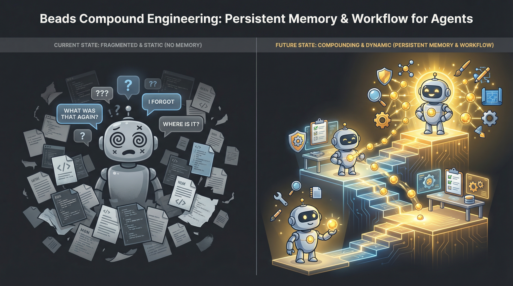

# Beads Compound Engineering Plugin

[](LICENSE)
[](https://github.com/roberto-mello/beads-compound-plugin/releases)
[](https://github.com/steveyegge/beads)

**AI agents that actually learn from their work.**

AI agents forget everything between sessions. You fix the same OAuth bug twice. You re-explain your architecture patterns every day. You scatter knowledge across dozens of markdown files that agents never find.

This plugin gives agents persistent memory and a set of commands and agents to help with comprehensive analysys, research and quality checks. They capture lessons during work, recall them automatically in future sessions, and compound knowledge over time, more like human developers do.

The included [workflow commands](#commands-26) will also create beads issues with very clear descriptions, context, dependencies, testing and validation criteria. No more disconnected markdown files scattered around the repository.

<div align="center">
  
</div>

## What This Does

**Without plugin:**
```bash
# Monday - you fix OAuth redirect bug
Agent: "How should I handle OAuth redirects?"
You: "They must match exactly, including trailing slash"
Agent: *implements fix*

# Wednesday - similar GitHub OAuth feature
Agent: "How should I handle OAuth redirects?"
You: *explains the same thing again* 😤
```

**With plugin:**
```bash
# Monday
Agent: *implements OAuth fix*
Agent: `LEARNED: OAuth redirect_uri must match exactly, including trailing slash`

# Wednesday
Agent: *automatically recalls: "OAuth redirect_uri must match exactly..."*
Agent: *implements correctly without asking*
```

The plugin captures knowledge as agents work, stores it in the filesystem, and recalls it automatically when relevant.

## Quick Wins You'll See Immediately

1. **Day 1:** Agent stops asking you "what error handling pattern should I use?"
2. **Week 1:** Team members benefit from each other's solved problems
3. **Month 1:** Agent recalls architectural decisions from 3 weeks ago without prompting
4. **Year 1:** New team members have instant access to institutional knowledge

## How It Compares

| Without Plugin | With Beads Compound |
|----------------|-------------|
| Context lost between sessions | Knowledge persists across all sessions |
| 5-10 min re-explaining context each session | Agent has context in <1 second |
| Same bugs recur across features | Patterns learned once, applied everywhere |
| Scattered markdown plans | Dependency-aware task graph (beads) |
| Agent forgets decisions | Decisions automatically recalled |
| Generic code review | 28 specialized review agents |
| Manual docs that go stale | Auto-captured, git-tracked, talways current |
| Repeat explanations | Agent learns your patterns |

## What's Included

**beads-compound** works with **Claude Code, OpenCode, and Gemini CLI**:

- **Automatic Memory** - Capture knowledge from comments, recall based on current work
- **28 Specialized Agents** - Research, security, performance, architecture analysis
- **26 Commands** - Plan features, execute work, review code, capture knowledge, recall mid-session
- **15 Skills** - Git worktrees, Rails style, DSPy integration, browser automation
- **3 Platform Support** - Claude Code, OpenCode, Gemini CLI

## This Might Not Be For You If...

- You work on throwaway prototypes (no need for persistent memory)
- You prefer total agent autonomy without structured workflows (we encourage planning)

## This is Perfect For You If...

- You maintain long-lived codebases
- Multiple people (or agents) work on the same project
- You're tired of wasting time and tokens re-explaining the same patterns
- You want agents that get smarter over time

## Example workflow

**Session 1 - Solving a problem:**
```
/beads-plan Fix OAuth login redirect (or /beads-plan <bead id>)

Agent:
- Recalls knoweldge about the topic
- Brainstorms with the user
- Does local research
- Determines if external research is needed
- Prepares well described tasks with validation criteria
- Files epic with dependent tasks if needed
- Presents options to user

Human:
(optional: /clear or /new for new session to clear context)

/beads-work <bead epic id> (or /beads-parallel <beads epic id>)

Agent(s):
- Loads well described tasks with dependencies
- Recalls knowledge relevant to each task
- Resolves the issues
- Saves knowledge relevant to what they learned about each task
- Closes the issue
``` 

**Session 2 - Building on that knowledge:**

```
/beads-plan Add GitHub OAuth provider

Agent:
- Automatically recalls "OAuth redirect_uri must match exactly..."
- Uses that context to implement correctly the first time
```

The knowledge persists in `.beads/memory/knowledge.jsonl` and also inserted into a local-only sqlite database for FTS5 full text searching with BM25 ranking (ignored in git). The jsonl can be committed to git so your whole team benefits.
## Quick Install

**Prerequisites:** [beads CLI](https://github.com/steveyegge/beads) (`bd`), `jq`, `sqlite`

### Option 1: Global Install (Recommended)

Get commands and agents everywhere, memory features auto-activate in beads projects:

```bash
git clone https://github.com/roberto-mello/beads-compound-plugin.git
cd beads-compound-plugin
./install.sh               # Installs to ~/.claude
OR ./install.sh --opencode # Installs to ~/.config/opencode/
OR ./install.sh --gemini   # Installs to ~/.config/gemini/
# Restart agent
```

Memory hooks auto-activate when you start youro coding agent into any project with a `.beads/` directory.

### Option 2: Per-Project Install

Install plugin for a specific project only:

```bash
./install.sh /path/to/your-project
# Restart your AI agent
```

**Tip:** Use `--yes` or `-y` to skip confirmation prompts.

### Native Plugin System (Coming Soon)

```bash
/plugin marketplace add https://github.com/roberto-mello/beads-compound-plugin
/plugin install beads-compound
```

Memory will auto-bootstrap on first session in any beads-enabled project.

### Multi-Platform Support

beads-compound supports AI coding agents beyond Claude Code:

#### OpenCode

**Install:**
```bash
# Global install (to ~/.config/opencode)
./install.sh --opencode

# Interactive model selection during install
# You'll be prompted to choose Claude models for each tier (haiku/sonnet/opus)
# Or use --yes to skip prompts and use defaults

# Or project-specific install
./install.sh --opencode /path/to/your-project
```

The installer copies the TypeScript plugin to `~/.config/opencode/plugins/beads-compound/` (global) or `.opencode/plugins/beads-compound/` (project-specific) and installs dependencies with Bun.

#### Gemini CLI

**Install:**
```bash
# Global install (to ~/.config/gemini)
./install.sh --gemini

# Or project-specific install
./install.sh --gemini /path/to/your-project
```

The installer copies hooks to `~/.config/gemini/hooks/` (global) or `.gemini/hooks/` (project-specific).

**Model Configuration:**

For OpenCode, you can customize which Claude models to use for each performance tier. See [docs/MODEL_SELECTION.md](docs/MODEL_SELECTION.md) for details on:
- Interactive model selection during installation
- Manual model configuration via `scripts/select-opencode-models.sh`
- Editing `scripts/shared/model-config.json` directly

#### Codex CLI / Antigravity

**Not yet supported.** Codex CLI hook system is planned but not shipped (PR #11067 closed). Antigravity has no lifecycle event system.

## Workflow Examples

Choose a workflow based on your needs. Each workflow shows a complete path from idea to shipped code.

### Quick Start Workflow

Fast iteration for simple features or bugs.

```
/beads-plan "add user notifications"       # Creates BD-001 with child beads
        ↓
/beads-work BD-001                         # Implement epic bead
        ↓
/beads-review BD-001.                      # Multi-agent code review
        ↓
/beads-checkpoint                          # Commit and capture knowledge
```

**Use when:** Feature is straightforward, requirements are clear, low complexity.

### Deep Planning Workflow

Thorough planning for complex features with research and review.

```
/beads-brainstorm "oauth authentication"
        ↓
/beads-plan "oauth authentication"         # Creates BD-002 with initial plan
        ↓
/beads-deepen BD-002                       # Enhances with best practices research
        ↓
/beads-plan-review BD-002                  # Multi-agent plan review
        ↓
/clear                                     # Clear context
        ↓
/beads-triage BD-002                       # Prioritize child beads
        ↓
/beads-work BD-002                         # Start implementation with parallel subagents
        ↓
/beads-review BD-002                       # Review implementation
        ↓
/beads-compound BD-002.1                   # Document learnings
```

**Use when:** Complex features, security-critical, architectural changes, unfamiliar territory.

### Parallel Work Workflow

Work on multiple beads simultaneously using subagents -- one per bead, organized into dependency-respecting waves.

```
/beads-plan "api refactor"                 # Creates BD-003 with child beads
        ↓
/beads-parallel BD-003                     # Work on all child beads in parallel
        ↓
/beads-review BD-003                       # Review all changes
```

**Use when:** Multiple independent tasks, tight deadlines, clear requirements.

**How it works:**
1. Analyzes file scopes to prevent agents from overwriting each other
2. Builds execution waves from the dependency graph (`bd swarm validate`)
3. Spawns one subagent per bead in each wave, with file ownership boundaries
4. Verifies results, commits per wave, then proceeds to the next wave
5. Transfers knowledge between waves so later agents benefit from earlier discoveries

#### `--ralph` mode: Autonomous Iterative Execution

Named after the ralph-wiggum pattern pioneered by Geoffrey Huntley. Regular `/beads-parallel` gives each subagent one shot. `--ralph` mode makes them self-correcting: each agent loops (implement -> verify -> fix -> retry) until its completion criteria are met or retries are exhausted.

```
/beads-parallel BD-003 --ralph                # Autonomous with defaults
/beads-parallel BD-003 --ralph --retries 3    # Max 3 retries per subagent (default 5)
/beads-parallel BD-003 --ralph --max-turns 20 # max turns per subagent (default 50, range 10-200)
/beads-parallel BD-003 --ralph --yes          # Skip plan approval (but NOT pre-push review)
```

**Key differences from regular mode:**

| | Regular | `--ralph` |
|---|---|---|
| Retries | None -- one shot per agent | Self-looping, up to N retries |
| Approval | Per-wave confirmation | Single approval at start, then autonomous |
| Completion signal | Agent reports results | Agent must output `<promise>DONE</promise>` |
| Completion criteria | Implicit (implement and report) | Derived from bead's Validation/Testing sections |
| Failed beads | Reported in summary | Left as `in_progress`, changes reverted, dependents skipped |
| Summary | Beads closed/failed | Adds retry counts, conflict-forced orderings |

**Completion criteria** are derived per-bead in priority order:
1. `## Validation` section in the bead description (from `/beads-plan`)
2. `## Testing` section in the bead description
3. Project test command (from CLAUDE.md)
4. Fallback: implementation matches the bead description

**Safety gates:**
- Test command validated against a known runner allowlist (no shell metacharacters)
- Pre-push diff review always requires explicit approval (`--yes` does not skip it)
- Knowledge entries wrapped in data-context blocks to prevent prompt injection
- Bead IDs validated with strict regex

### Import & Refine Workflow

Starting from existing markdown plans or external documentation.

```
/beads-import plan.md                      # Creates BD-004 from markdown
        ↓
/beads-deepen BD-004                       # Add research and best practices
        ↓
/beads-work BD-004                         # Start implementation
        ↓
/beads-checkpoint                          # Save progress
```

**Use when:** You have external plans, migrating from other tools, inheriting documentation.

### Ad-Hoc Sessions

Let's say you've been discussing a change or feature in several exchanges with the agent. You didn't plan it, just started doing things. This plugin allows for memory recalling into the existing context as well as "closing the loop" on changes made by creating beads issues on things already done, with automatic memory gathering and saving based on context and recent changes. For example:

```
<done some work with the agent>

/beads-recall oauth and authentication

# Database is queried for topics related to the query, and memory is injected into context

<do some more work>

# When you're done with your changes

/beads-checkpoint

# Agent will:
#   - go through context and recent changes
#   - create beads issues for what was done
#   - save memories, lessons learned to the issues
#   - close issues
```

## What's Included

### Always-On Features

1. **Automatic Knowledge Capture** -- Any `bd comments add` with LEARNED/DECISION/FACT/PATTERN/INVESTIGATION gets extracted and stored in both SQLite FTS5 (`knowledge.db`) and JSONL (`knowledge.jsonl`). When you use the [workflow commands](#commands-26) with descriptions or beads issues, knowledge is automatically captured. Manually at any time you can use `/beads-checkpoint` or `/beads-compound`.

2. **Automatic Knowledge Recall** -- Session start hook injects relevant knowledge based on your current beads, using FTS5 full-text search with BM25 ranking for much better results on conceptual and multi-word queries. Using the [workflow commands](#commands-26) with descriptions or beads issues, knowledge is automatically recalled by agents and subagents. Manually at any time you can use `/beads-recall` to search the database and inject memories into context.

3. **Subagent Knowledge Enforcement** -- The `subagent-wrapup.sh` hook (SubagentStop) blocks subagent completion until at least one knowledge comment is logged. If a BEAD_ID is found in the transcript and no LEARNED/DECISION/FACT/PATTERN/INVESTIGATION comment was captured, the subagent is re-prompted to log its findings before exiting.

### Commands (26)

Commands are organized by use case to help you choose the right tool for the job.

#### Planning & Discovery (4 commands)

Explore ideas and create structured plans before writing code.

| Command | Description | When to Use |
|---------|-------------|-------------|
| `/beads-brainstorm` | Explore ideas collaboratively | When requirements are unclear or you need to explore approaches |
| `/beads-plan` | Research and create epic with child beads | Start every feature - creates structured plan with research |
| `/beads-deepen` | Enhance plan with parallel research agents | For complex features - adds depth and best practices |
| `/beads-plan-review` | Multi-agent review of epic plan | Before implementation - catch issues early |

#### Executing Work (3 commands)

Implement features and fix bugs using beads for tracking.

| Command | Description | When to Use |
|---------|-------------|-------------|
| `/beads-work` | Work on a single bead with full lifecycle | Standard workflow - one bead at a time |
| `/beads-parallel` | Work on multiple beads in parallel (`--ralph` for autonomous retry) | Speed up delivery - multiple independent beads |
| `/beads-triage` | Prioritize and categorize beads | After planning or review - organize work queue |

#### Reviewing & Quality (2 commands)

Ensure code quality and capture knowledge before shipping.

| Command | Description | When to Use |
|---------|-------------|-------------|
| `/beads-review` | Multi-agent code review | Before closing beads - comprehensive quality check |
| `/beads-import` | Import markdown plans into beads | When you have external plans to convert |

#### Ad-hoc sessions: Recalling Knowledge and Saving Progress (3 commands)

Capture knowledge and save session state.

| Command | Description | When to Use |
|---------|-------------|-------------|
| `/beads-recall` | Search knowledge base and inject context | When you need past learnings mid-session without restarting |
| `/beads-checkpoint` | Save progress, create/update beads, commit | Mid-session - checkpoint your work |
| `/beads-compound` | Deep problem documentation with parallel analysis | After solving hard problems - share learnings |

#### Utility Commands (15)

| Command | Description |
|---------|-------------|
| `/lfg` | Full autonomous engineering workflow |
| `/changelog` | Create engaging changelogs for recent merges |
| `/create-agent-skill` | Create or edit Claude Code skills |
| `/generate-command` | Create a new custom slash command |
| `/heal-skill` | Fix incorrect SKILL.md files |
| `/deploy-docs` | Validate and prepare documentation for deployment |
| `/release-docs` | Build and update documentation |
| `/feature-video` | Record a video walkthrough for a PR |
| `/agent-native-audit` | Comprehensive agent-native architecture review |
| `/test-browser` | Run browser tests on affected pages |
| `/xcode-test` | Build and test iOS apps on simulator |
| `/report-bug` | Report a bug in the plugin |
| `/reproduce-bug` | Reproduce and investigate a bug |
| `/resolve-pr-parallel` | Resolve all PR comments in parallel |
| `/resolve-todo-parallel` | Resolve all pending TODOs in parallel |

### Agents (28) -- Cost-Optimized by Model Tier

All agents include model tier assignments for optimal cost/performance balance:

**Haiku Tier (5 agents)** -- Structured tasks, fast and cheap:
- learnings-researcher, repo-research-analyst, framework-docs-researcher, ankane-readme-writer, lint

**Sonnet Tier (14 agents)** -- Moderate judgment, balanced cost:
- code-simplicity-reviewer, kieran-rails-reviewer, kieran-python-reviewer, kieran-typescript-reviewer, dhh-rails-reviewer, security-sentinel, pattern-recognition-specialist, deployment-verification-agent, best-practices-researcher, git-history-analyzer, design-implementation-reviewer, design-iterator, figma-design-sync, bug-reproduction-validator, pr-comment-resolver, every-style-editor

**Opus Tier (9 agents)** -- Deep reasoning, premium quality:
- architecture-strategist, performance-oracle, data-integrity-guardian, data-migration-expert, agent-native-reviewer, julik-frontend-races-reviewer, spec-flow-analyzer

The most frequently invoked agents (learnings-researcher, repo-research-analyst) run on Haiku for maximum efficiency. Review workflows intelligently mix tiers based on complexity.

### Skills (15)

| Skill | Description |
|-------|-------------|
| `git-worktree` | Manage git worktrees for parallel bead work |
| `brainstorming` | Structured brainstorming with bead output |
| `create-agent-skills` | Create new agents and skills |
| `agent-native-architecture` | Design agent-native system architectures |
| `beads-knowledge` | Document solved problems as knowledge entries |
| `agent-browser` | Browser automation for testing and screenshots |
| `andrew-kane-gem-writer` | Write Ruby gems following Andrew Kane's style |
| `dhh-rails-style` | Rails development following DHH's conventions |
| `dspy-ruby` | DSPy integration for Ruby applications |
| `every-style-editor` | Every's house style guide for content editing |
| `file-todos` | Find and manage TODO comments in code |
| `frontend-design` | Frontend design patterns and best practices |
| `gemini-imagegen` | Generate images using Google's Gemini |
| `rclone` | Cloud storage file management with rclone |
| `skill-creator` | Create new skills from templates |

### MCP Servers

- **Context7** -- Framework documentation lookup

### Hooks (4 + shared library)

| Hook | Trigger | Purpose |
|------|---------|---------|
| auto-recall.sh | SessionStart | Inject relevant knowledge at session start (FTS5-first, grep fallback) |
| memory-capture.sh | PostToolUse (Bash) | Extract knowledge from bd comments (dual-write to SQLite + JSONL) |
| subagent-wrapup.sh | SubagentStop | Ensure subagents log learnings |
| check-memory.sh | SessionStart (global) | Auto-detect beads projects missing memory setup |
| knowledge-db.sh | (library) | Shared SQLite FTS5 functions sourced by other hooks |

## Cost Optimization

The plugin's 28 agents are assigned to three model tiers based on reasoning complexity:

| Tier | Agents | Use Case | Cost Impact |
|------|--------|----------|-------------|
| **Haiku** | 5 | Structured information retrieval, template-based output | Lowest cost, fastest response |
| **Sonnet** | 14 | Moderate judgment with established patterns | Balanced cost/quality |
| **Opus** | 9 | Deep architectural reasoning, nuanced security analysis | Premium quality for critical decisions |

**Key optimizations:**
- Most frequently invoked agents (`learnings-researcher`, `repo-research-analyst`) use Haiku
- Review workflows like `/beads-review` fire 13+ agents, mostly Sonnet tier
- Opus reserved for architectural/security decisions requiring deep reasoning
- Commands automatically dispatch agents at their assigned tier via frontmatter `model:` field

This tiering reduces costs by 60-70% compared to running all agents on Opus while maintaining quality where it matters.

## Architecture

### Memory System

Knowledge is stored in two formats:

- **SQLite FTS5** (`knowledge.db`) -- Primary search backend with full-text search and BM25 ranking
- **JSONL** (`knowledge.jsonl`) -- Portable export format, grep-compatible fallback

Both are written to simultaneously. If `sqlite3` is unavailable, only JSONL is written and grep-based search is used automatically.

```json
{
  "key": "learned-oauth-redirect-must-match-exactly",
  "type": "learned",
  "content": "OAuth redirect URI must match exactly",
  "source": "user",
  "tags": ["oauth", "auth", "security"],
  "ts": 1706918400,
  "bead": "BD-001"
}
```

- **FTS5 Search**: Uses porter stemming and BM25 ranking -- "webhook authentication" finds entries about HMAC signature verification even when those exact words don't appear together
- **Auto-tagging**: Keywords detected and added as tags
- **Git-tracked**: Knowledge files can be committed to git for team sharing and portability
- **Conflict-free collaboration**: Multiple users can capture knowledge simultaneously without merge conflicts
- **Auto-sync**: First session after `git pull` automatically imports new knowledge into local search index
- **Rotation**: After 5000 entries, oldest 2500 archived (JSONL only)
- **Search**: `.beads/memory/recall.sh "keyword"` or automatic at session start

### Plugin Structure

```
beads-compound-plugin/              # Marketplace root
├── .claude-plugin/
│   └── marketplace.json
├── plugins/
│   └── beads-compound/             # Plugin root
│       ├── .claude-plugin/
│       │   └── plugin.json
│       ├── agents/
│       │   ├── review/             # 14 review agents
│       │   ├── research/           # 5 research agents
│       │   ├── design/             # 3 design agents
│       │   ├── workflow/           # 5 workflow agents
│       │   └── docs/               # 1 docs agent
│       ├── commands/               # 26 commands
│       ├── skills/                 # 15 skills
│       ├── hooks/                  # 4 hooks + shared library + hooks.json
│       ├── scripts/
│       └── .mcp.json
├── install.sh
├── uninstall.sh
├── CLAUDE.md
└── README.md
```

## Migrating Existing Projects

If you already have a project using the plugin with an existing `knowledge.jsonl`, re-running the installer will upgrade it:

```bash
# Re-run the installer (safe to run on existing installs)
bash /path/to/beads-compound-plugin/install.sh /path/to/your-project
```

On the next Claude Code session start, the system will automatically:
1. Create `knowledge.db` with the FTS5 schema
2. Import all entries from your existing `knowledge.jsonl` and `knowledge.archive.jsonl`
3. Import any knowledge-prefixed comments from `beads.db`

After this one-time import, new entries are written to both formats. Your existing JSONL files remain intact and continue to be written to.

**Prerequisite**: `sqlite3` must be available (pre-installed on macOS and most Linux distributions). If missing, the system gracefully falls back to grep-based search with no errors.

## Uninstall

```bash
# Global uninstall
./uninstall.sh

# Project-specific uninstall
./uninstall.sh /path/to/your-project
```

Removes plugin components but preserves `.beads/` data and accumulated knowledge. Global uninstall also removes the `check-memory` hook and plugin source path.

## Changes from Compound Engineering

This plugin is a fork of [compound-engineering-plugin](https://github.com/EveryInc/compound-engineering-plugin) (MIT license) with the following changes:

### Memory System

- Replaced markdown-based knowledge storage with beads-based persistent memory (`.beads/memory/knowledge.jsonl`)
- SQLite FTS5 full-text search with BM25 ranking for knowledge recall, improving precision by 18%, recall by 17%, and MRR by 24% over grep-based search across 25 benchmark queries
- Automatic knowledge capture from `bd comments add` with typed prefixes (LEARNED/DECISION/FACT/PATTERN/INVESTIGATION), dual-writing to SQLite (for fast searching with fuzzy matching) and JSONL (for committing to git)
- Automatic knowledge recall at session start based on open beads and git branch context
- Subagent knowledge enforcement via `SubagentStop` hook
- All workflows create and update beads instead of markdown files
- Automatic one-time backfill from existing JSONL and beads.db comments on first FTS5 run
- First session (like cloning a beads-compound enabled repo) triggers rebuilding the FTS5 index from the JSONL in git. Everything self-heals on first session.

### Performance Optimizations

- **Context budget optimization (94% reduction)**: Plugin now uses only 8,227 chars of Claude Code's 16,000 char description budget. This prevents components from being silently excluded from Claude's context.
  - Trimmed all 28 agent descriptions to under 250 chars, moving verbose examples into agent bodies wrapped in `<examples>` tags
  - Added `disable-model-invocation: true` to 17 manual utility commands (they remain available when explicitly invoked via `/command-name` but don't clutter Claude's auto-suggestion context)
  - Added `disable-model-invocation: true` to 7 manual utility skills (beads-knowledge, create-agent-skills, file-todos, skill-creator, git-worktree, rclone, gemini-imagegen)
  - Core beads workflow commands (`/beads-brainstorm`, `/beads-plan`, `/beads-work`, `/beads-parallel`, `/beads-review`, `/beads-compound`, `/beads-deepen`, `/beads-plan-review`) remain fully auto-discoverable
- **Model tier assignments**: Each agent specifies a `model:` field (haiku/sonnet/opus) based on reasoning complexity, reducing costs 60-70% compared to running all agents on the default model. High-frequency agents like `learnings-researcher` run on Haiku; deep reasoning agents like `architecture-strategist` run on Opus.

### Structural Changes

- Rewrote `learnings-researcher` to search `knowledge.jsonl` instead of markdown docs
- Adapted `code-simplicity-reviewer` to protect `.beads/memory/` files
- Renamed `compound-docs` skill to `beads-knowledge`
- Added `beads-` prefix to all commands to avoid conflicts

## Troubleshooting

### Memory Features Not Working

If automatic knowledge capture or recall isn't working, check your setup:

#### Claude Code

```bash
# Check if hooks are installed
ls -la .claude/hooks/

# Check hook configuration
cat .claude/settings.json | jq '.hooks'

# Check memory directory
ls -la .beads/memory/

# Test knowledge capture manually
bd comments add <BEAD_ID> "LEARNED: Testing memory capture"
tail -1 .beads/memory/knowledge.jsonl

# Test recall manually
bash .beads/memory/recall.sh
```

**Expected hooks in settings.json:**
- `SessionStart`: `auto-recall.sh`
- `PostToolUse` (Bash matcher): `memory-capture.sh`
- `SubagentStop`: `subagent-wrapup.sh`

#### OpenCode

```bash
# Check if plugin is installed
# Project-specific:
ls -la .opencode/plugins/beads-compound/plugin.ts

# Global:
ls -la ~/.config/opencode/plugins/beads-compound/plugin.ts

# Check if commands/agents/skills/hooks are installed
ls -la .opencode/commands/
ls -la .opencode/agents/
ls -la .opencode/skills/
ls -la .opencode/hooks/

# Check if plugin is loading (look for console.log messages in OpenCode output)
# Expected: "[beads-compound] Plugin loaded successfully"
# Expected: "[beads-compound] session.created hook triggered"

# Check memory directory
ls -la .beads/memory/

# Test knowledge capture manually
bd comments add <BEAD_ID> "LEARNED: Testing memory capture"
tail -1 .beads/memory/knowledge.jsonl

# Check plugin dependencies are installed
ls -la .opencode/plugins/beads-compound/node_modules/
# Or for global: ls -la ~/.config/opencode/plugins/beads-compound/node_modules/
```

#### Gemini CLI

```bash
# Check if hooks are installed (project-specific)
ls -la .gemini/hooks/

# Or global install
ls -la ~/.config/gemini/hooks/

# Check hook configuration in gemini-extension.json
cat gemini-extension.json | jq '.hooks'

# Check memory directory
ls -la .beads/memory/

# Test knowledge capture manually
bd comments add <BEAD_ID> "LEARNED: Testing memory capture"
tail -1 .beads/memory/knowledge.jsonl
```

### Common Issues

**No knowledge entries being saved:**
- Ensure you're using `bd comments add <BEAD_ID> "LEARNED: ..."` format (not `bd comment`)
- Check that the hook is configured in settings.json with correct matcher (e.g., `"Bash"` for PostToolUse)
- Verify `.beads/memory/` directory exists
- Test the hook manually using the platform-specific commands above

**Knowledge recall not showing context:**
- Check that `auto-recall.sh` is in SessionStart hooks
- Verify you have open or in_progress beads: `bd list --status=open`
- Run manual recall to test: `bash .beads/memory/recall.sh`
- Check if `knowledge.jsonl` has entries: `wc -l .beads/memory/knowledge.jsonl`

**SQLite search not working:**
- Verify `sqlite3` is installed: `which sqlite3`
- Check database exists: `ls -la .beads/memory/knowledge.db`
- System automatically falls back to grep if SQLite unavailable

**Duplicate entries in knowledge.jsonl:**
- This was fixed in v0.6.0+. Update to latest version.
- To clean up existing duplicates:
  ```bash
  cd .beads/memory
  cp knowledge.jsonl knowledge.jsonl.backup
  jq -s 'group_by(.key) | map(max_by(.ts)) | .[] | @json' knowledge.jsonl > knowledge.jsonl.tmp
  mv knowledge.jsonl.tmp knowledge.jsonl
  ```

## Importing Existing Plans

```bash
bash ~/beads-compound-plugin/plugins/beads-compound/scripts/import-plan.sh your-plan.md "Epic Title"
```

Creates an epic bead with child beads for each implementation step.

## Acknowledgments

[Every](https://every.to)'s [writing on compound engineering](https://every.to/chain-of-thought/compound-engineering-how-every-codes-with-agents) is well worth reading.

Task tracking is powered by Steve Yegge's [Beads](https://github.com/steveyegge/beads).

Built by Roberto Mello based on [compound-engineering](https://github.com/EveryInc/compound-engineering-plugin) by the team at [Every](https://every.to), extending their philosophy with persistent memory and performance optimizations.

## License

MIT (same as compound-engineering-plugin)
