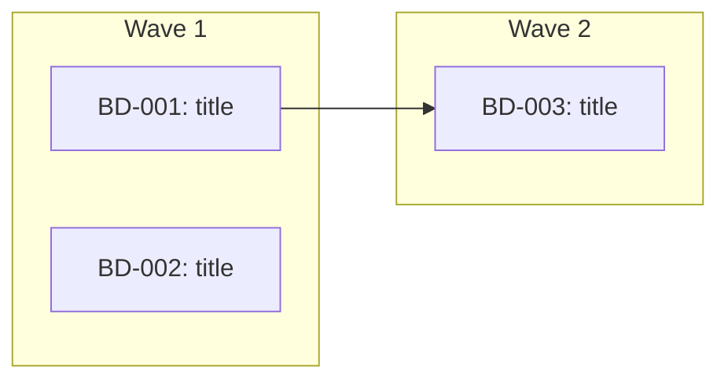

Work on multiple beads in parallel, giving each subagent the full beads-work treatment.

## Input

<bead_input> #$ARGUMENTS </bead_input>

## Workflow

### 1. Gather Beads

**If input is an epic bead ID:**
```bash
bd list --parent {EPIC_ID} --status=open --json
```

**If input is a comma-separated list of bead IDs:**
Parse and fetch each one.

**If input is empty:**
```bash
bd ready --json
```

For each bead, read full details:
```bash
bd show {BEAD_ID}
```

Skip any bead that recommends deleting, removing, or gitignoring files in `.beads/memory/`. Close it immediately:
```bash
bd close {BEAD_ID} --reason "wont_fix: .beads/memory/ files are pipeline artifacts"
```

### 2. Branch Check

Check the current branch:

```bash
current_branch=$(git branch --show-current)
default_branch=$(git symbolic-ref refs/remotes/origin/HEAD 2>/dev/null | sed 's@^refs/remotes/origin/@@')
if [ -z "$default_branch" ]; then
  default_branch=$(git rev-parse --verify origin/main >/dev/null 2>&1 && echo "main" || echo "master")
fi
```

**If on the default branch**, use AskUserQuestion:

**Question:** "You're on the default branch. Create a working branch for these changes?"

**Options:**
1. **Yes, create branch** - Create `bd-parallel/{short-description}` and work there
2. **No, work here** - Commit directly to the current branch

If creating a branch:
```bash
git pull origin {default_branch}
git checkout -b bd-parallel/{short-description-from-bead-titles}
```

**If already on a feature branch**, continue working there.

### 3. Dependency Analysis

Check dependencies between the gathered beads:

```bash
# For each bead
bd show {BEAD_ID} --json | jq '.dependencies'
```

Build a dependency graph and organize into **execution waves**:

- **Wave 1**: Beads with no unresolved dependencies (can all run in parallel)
- **Wave 2**: Beads that depend on wave 1 completions
- **Wave N**: And so on

Output a mermaid diagram showing the execution plan:



Present the plan and get user approval before proceeding.

### 4. Recall Knowledge

Search memory once for all beads to prime context:

```bash
# Extract keywords from all bead titles
.beads/memory/recall.sh "{combined keywords}"
```

Include relevant knowledge in each subagent prompt.

### 5. Execute Waves

For each wave, spawn **general-purpose** agents in parallel -- one per bead.

Each agent gets a detailed prompt containing:
- The full bead description (from `bd show`)
- Relevant knowledge entries from the recall step
- Clear instructions to follow the beads-work methodology

**Agent prompt template:**

```
Work on bead {BEAD_ID}: {title}

## Bead Details
{full bd show output}

## Relevant Knowledge
{matching knowledge entries}

## Instructions

1. Mark in progress: `bd update {BEAD_ID} --status in_progress`

2. Read the bead description completely. If referencing existing code or patterns, read those files first. Follow existing conventions.

3. Implement the changes:
   - Follow existing patterns in the codebase
   - Write tests for new functionality
   - Run tests after changes

4. Log at least one knowledge comment:
   ```
   bd comments add {BEAD_ID} "LEARNED: {key insight}"
   bd comments add {BEAD_ID} "DECISION: {choice made and why}"
   bd comments add {BEAD_ID} "FACT: {constraint or gotcha}"
   bd comments add {BEAD_ID} "PATTERN: {pattern followed}"
   ```

5. When done, report what changed and any issues encountered. Do NOT commit or close the bead -- the orchestrator handles that.

BEAD_ID: {BEAD_ID}
```

Launch all agents for the current wave in a single message:

```
Task(general-purpose, "...prompt for BD-001...")
Task(general-purpose, "...prompt for BD-002...")
Task(general-purpose, "...prompt for BD-003...")
```

**Wait for the entire wave to complete before starting the next wave.**

### 6. Verify Wave Results

After each wave completes:

1. **Review agent outputs** for any reported issues or conflicts
2. **Run tests** to verify nothing is broken:
   ```bash
   # Use project's test command from CLAUDE.md
   ```
3. **Run linting** if applicable
4. **Resolve conflicts** if multiple agents touched the same files
5. **Create an incremental commit** for the wave:
   ```bash
   git add <changed files>
   git commit -m "feat: resolve wave N beads (BD-XXX, BD-YYY)"
   ```
6. **Close completed beads:**
   ```bash
   bd close {BD-XXX} {BD-YYY} {BD-ZZZ}
   ```

Proceed to the next wave only after verification passes.

### 7. Final Steps

After all waves complete:

1. **Push to remote:**
   ```bash
   git push
   bd sync
   ```

2. **Output summary:**

```markdown
## Parallel Work Complete

**Waves executed:** {count}
**Beads resolved:** {count}
**Beads skipped:** {count}
**Beads failed:** {count}

### Wave 1:
- BD-XXX: {title} - Closed
- BD-YYY: {title} - Closed

### Wave 2:
- BD-ZZZ: {title} - Closed

### Skipped:
- BD-AAA: {title} - Reason: {reason}

### Failed:
- BD-BBB: {title} - Issue: {description}

### Knowledge captured:
- {count} entries logged across all beads
```

3. **Offer next steps** with AskUserQuestion:

   **Question:** "All waves complete. What next?"

   **Options:**
   1. **Run `/beads-review`** on the changes
   2. **Create a PR** with all changes
   3. **Continue** with remaining open beads
